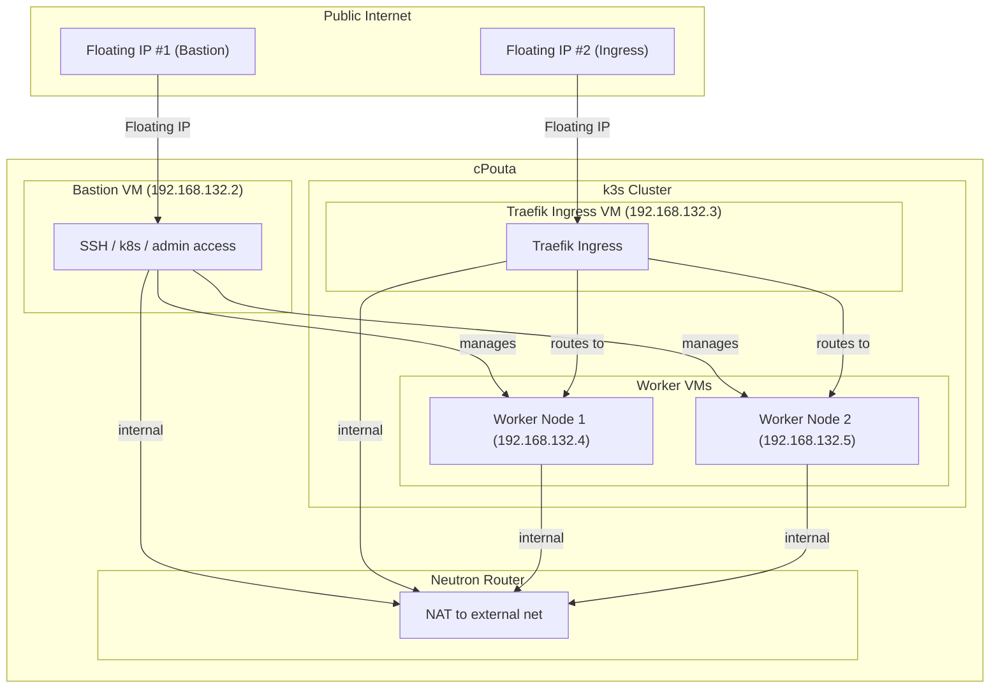

# cPouta to k3s

This document describes the process of setting up a k3s cluster on cPouta, the Finnish research and education cloud.

## General Concept

The following diagram illustrates the setup:



## Input Configuration

The `input.yml` file is used to configure the deployment. You can use the `input.example.yml` as a template.

```yaml
ssh_public_key_path: "~/.ssh/id_ed25519.pub"
ssh_private_key_path: "~/.ssh/id_ed25519"

internal_network:
  name: "k3s-internal"
  subnet:
    name: "k3s-subnet"
    network_cidr: "192.168.132.0/24"

bastion:
  name: "bastion"
  flavor: "standard.small" # To get a list of available flavors, run: openstack flavor list
  image: "Ubuntu-22.04" # To get a list of available images, run: openstack image list

neutron_router:
  name: "k3s-router-to-public"
  external_network:
    name: "public"
    id: "<your-external-network-id>" # To get the ID of the external network, run: openstack network list --external
  internal_network:
    name: "k3s-internal"

firewall:
  firewall_external:
    - name: "allow-ssh"
      ports: ["22"]
      source_ranges: ["0.0.0.0/0"]
    - name: "allow-http"
      ports: ["80"]
      source_ranges: ["0.0.0.0/0"]
  firewall_internal:
    - name: "allow-all-internal"
      ports: ["0-65535"]
      source_ranges: ["192.168.132.0/24"]

# 1 master and many worker
k3s:
  masters:
    name: "k3s-master"
    role: "master"
    user: "ubuntu"
    image: "Ubuntu-22.04" # To get a list of available images, run: openstack image list
    flavor: "standard.small" # To get a list of available flavors, run: openstack flavor list
    number: 1
  workers:
    name: "k3s-worker"
    role: "worker"
    user: "ubuntu"
    image: "Ubuntu-22.04" # To get a list of available images, run: openstack image list
    flavor: "standard.small" # To get a list of available flavors, run: openstack flavor list
    number: 1
  ip: "<your-cluster-ip>"
  vars:
    ansible_user: ubuntu
    k3s_version: v1.33.0+k3s1
    extra_server_args: "--flannel-backend=none --disable-network-policy"
```

## Prerequisites

- Authentication with csc:
  - Download OpenStack RC File from your cPouta account.
  - Source the OpenStack RC file:

    ```bash
    source <OpenStack_RC>.sh
    ```

## Workflow

1.  **Generate Scripts and Initial Configuration:**

    Run the Go program to generate the necessary scripts and Terraform configuration from the templates.

    ```bash
    go run ./src
    ```

2.  **Create Network Infrastructure:**

    Create the internal network, subnet, and router using the generated scripts.

    ```bash
    ./output/script/create_network.sh
    ./output/script/create_router.sh
    ```

3.  **Deploy Virtual Machines with Terraform:**

    Navigate to the Terraform directory and deploy the virtual machines.

    ```bash
    cd src/output/terraform
    terraform init
    terraform apply -auto-approve
    ```

4.  **Generate Final Configuration:**

    Run the Go program again. This time, it will fetch the IP addresses of the newly created virtual machines and update the configuration files (like the Ansible inventory).

    ```bash
    cd ../../.. # Return to the root of the repository
    go run ./src
    ```

5.  **Provision the Cluster with Ansible:**

    Use the generated Ansible playbook and inventory to provision the k3s cluster on the new virtual machines. This is typically done from the bastion host.

6.  **Clean Up:**

    When you are finished, destroy the Terraform resources and delete the network infrastructure.

    ```bash
    cd src/output/terraform
    terraform destroy -auto-approve
    cd ../../.. # Return to the root of the repository
    ./output/script/delete_router.sh
    ./output/script/delete_network.sh
    ```

## Bastion

### Reusing a current one

- SSH to the bastion machine.

#### Prerequisites

- Request DHCP to the new internal network `192.168.132.0/24`.

  ```yaml
  # /etc/netplan/50-cloud-init.yaml
  network:
    version: 2
    ethernets:
      ens7: # This name appears from the execution of setup_bastion "openstack server add network bastion k3s-internal"
        dhcp4: true
  ```

- Apply the new network configuration:

  ```bash
  sudo netplan apply
  ```

- [Ansible setting and k3s-ansible](https://github.com/k3s-io/k3s-ansible/tree/master):

  ```bash
  sudo apt-get install -y ansible-core
  ansible-galaxy collection install git+https://github.com/k3s-io/k3s-ansible.git
  ```

### Setting up a fresh one

-- currently SKIP

## Setting K3s - On Bastion machine

- SCP inventory and private SSH key to the bastion file.

  ```yaml
  # k3s.inventory.yml
  k3s_cluster:
    children:
      server:
        hosts:
          <IP>:
      agent:
        hosts:
          <IP>:
    vars:
      ansible_user: <machine-user>
      extra_server_args: --flannel-backend=none --disable-network-policy
      k3s_version: v1.33.0+k3s1
      api_endpoint: <IP>
  ```

- Setup DNS for update before applying k3s:

  ```bash
  ANSIBLE_HOST_KEY_CHECKING=False ansible-playbook k3s_setDNS.yml -i k3s_inventory.yml
  ansible-playbook k3s.orchestration.site -i k3s_inventory.yml
  ```

- Install [kubectl](https://kubernetes.io/docs/tasks/tools/install-kubectl-linux/) and [helm](https://helm.sh/docs/intro/install/).

- Setting kubectl for this interaction:
  - kubectl
  - cilium

  ```bash
  ./output/script/setup_network.sh
  ```

## Testing

- Use an example:

  ```bash
  kubectl apply -f services/my-service.yml
  ```

- Edit `/etc/hosts`:

  ```bash
  echo "<Floating IP to cluster> myapp.example.com" | sudo tee -a /etc/hosts
  ```

- Request from anywhere:

  ```bash
  curl -v http://myapp.example.com
  ```

## Loadbalancer to cluster

### Openstack-native (Octavia LBaaS)

- **Pros:** Native, HA managed by OpenStack.
- **Cons:** Each listener = static mapping, so not very Kubernetes-friendly if services change often.

### Traefik

- **Pros:** Flexible, Kubernetes-native, can expose 4–5 (or hundreds of) services behind one Floating IP.
- **Cons:** Traefik VM is a single point unless you deploy HA (can still scale with multiple Traefik pods).

With this setting, the connection to the cluster is based on the hostname.

## Error

```bash
│ Error: Error creating openstack_networking_floatingip_v2: Expected HTTP response code [201 202] when accessing [POST https://pouta.csc.fi:9697/v2.0/floatingips], but got 409 instead
│ {"NeutronError": {"type": "OverQuota", "message": "Quota exceeded for resources: ['floatingip'].", "detail": ""}}
│
│   with openstack_networking_floatingip_v2.master_fip,
│   on main.tf line 104, in resource "openstack_networking_floatingip_v2" "master_fip":
│  104: resource "openstack_networking_floatingip_v2" "master_fip" {
```

To fix this, you can list and delete floating IPs:

```bash
openstack floating ip list
openstack floating ip delete <id>
```
